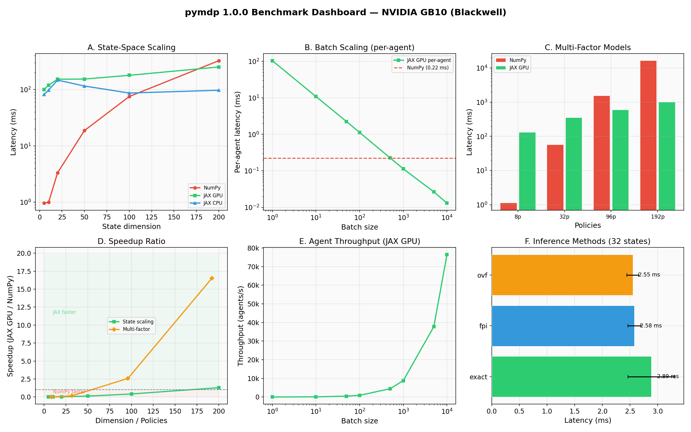
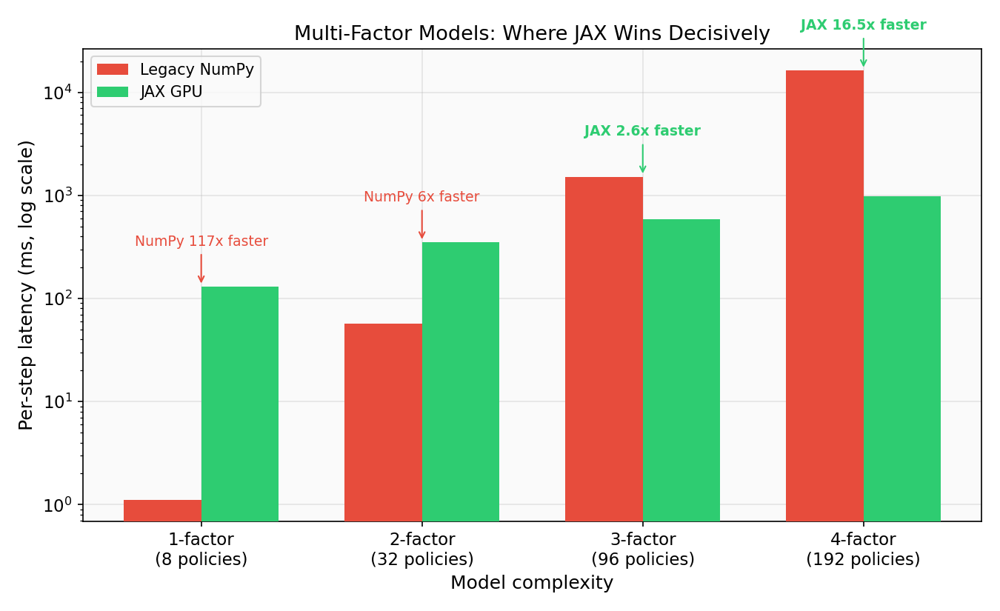
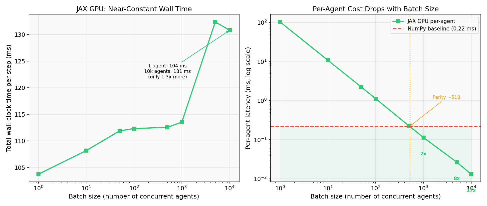
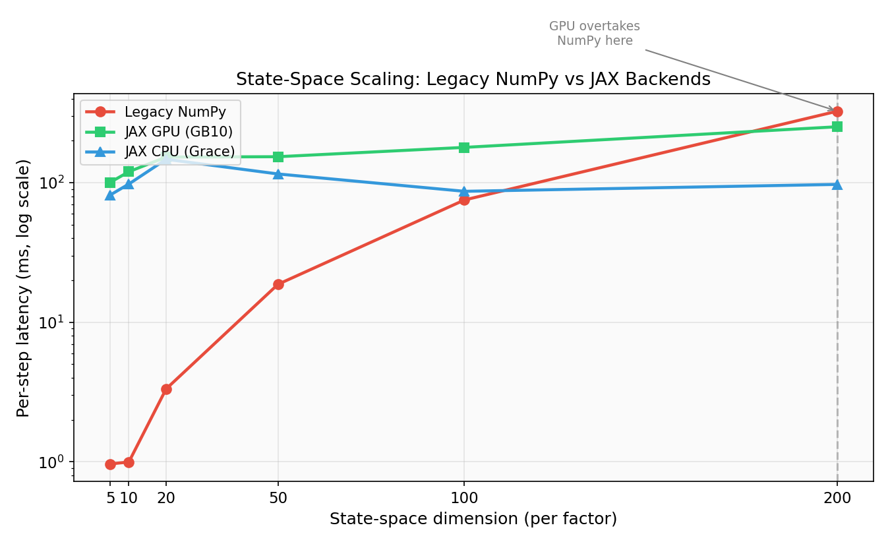
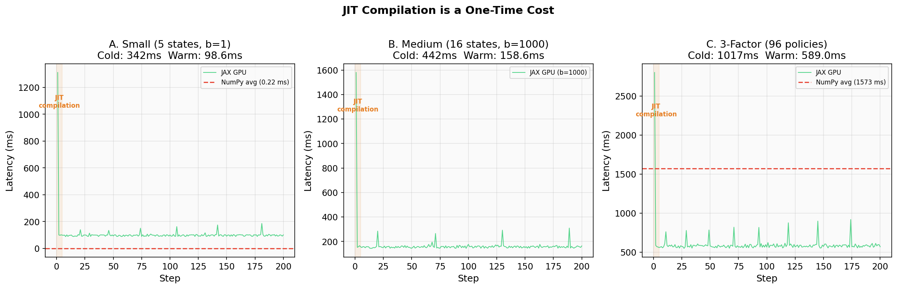
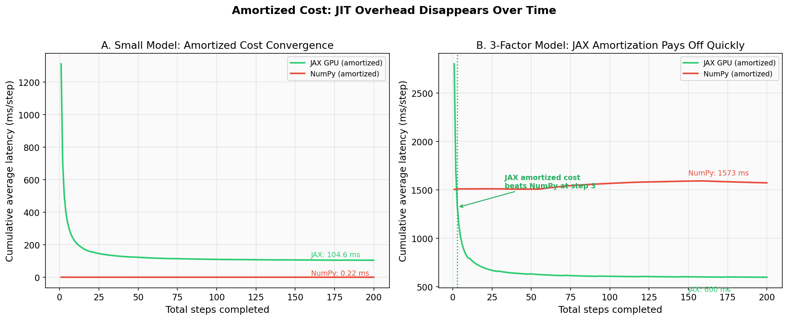
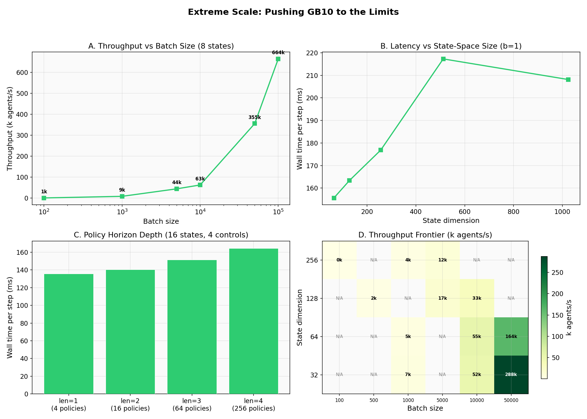
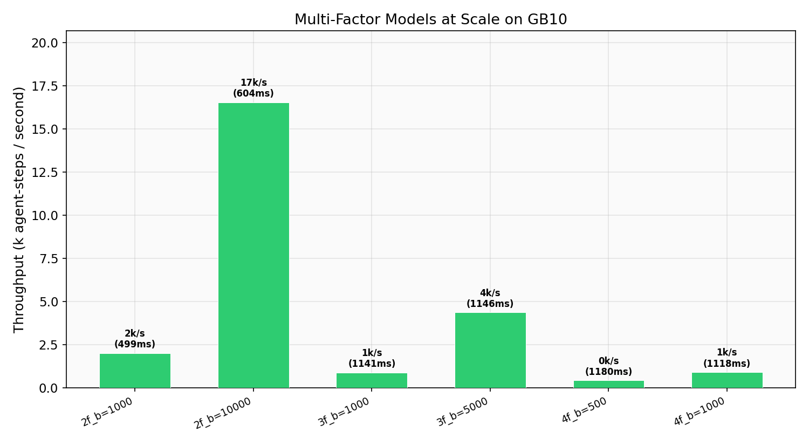
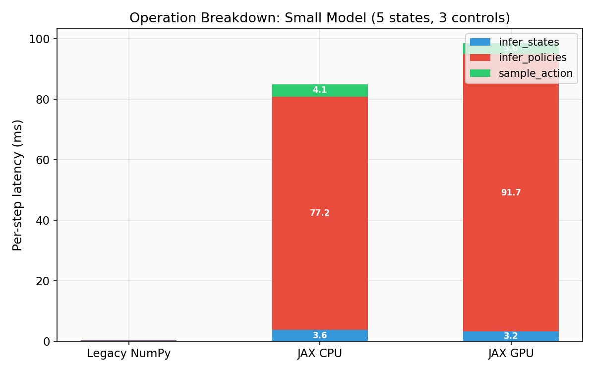
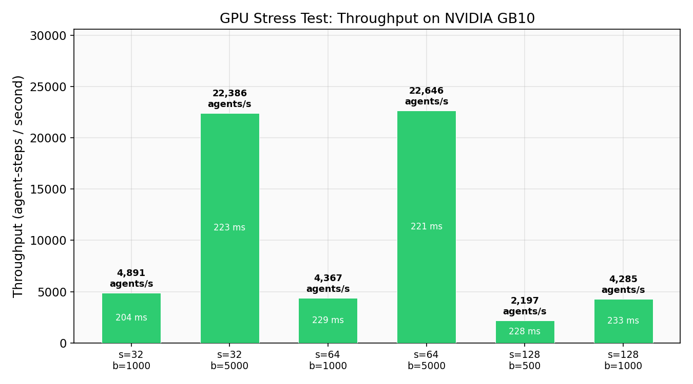

# pymdp 1.0.0 JAX Backend Benchmark

[](README.md) [](README_CN.md)

      

Comprehensive performance evaluation of [pymdp](https://github.com/infer-actively/pymdp) 1.0.0 — the first major release that migrates Active Inference from NumPy to JAX.

**Hardware**: NVIDIA GB10 (Grace Blackwell Superchip, aarch64)  
**Software**: pymdp 1.0.0 | JAX 0.9.2 | CUDA 13.1 | Driver 580.95.05  
**Date**: 2026-04-09

---

## Overview

pymdp 1.0.0 is a fundamental architectural rewrite: the entire Active Inference pipeline (state inference, policy evaluation, action sampling) is now built on JAX, enabling GPU acceleration, JIT compilation, and massive batch parallelism. This project provides an **empirical, quantitative answer** to the question: *how much faster is it, when, and where are the limits?*

### Dashboard



---

## Key Findings

### 1. Multi-Factor Models: Where JAX Wins Decisively

This is the most important result. Real-world Active Inference models typically have multiple interacting state factors, which causes the number of policies to grow combinatorially. Legacy NumPy evaluates each policy sequentially; JAX vectorizes the entire computation.



| Factors | Policies | Legacy NumPy | JAX GPU | Speedup |
|---------|----------|-------------|---------|---------|
| 1       | 8        | 1.1 ms      | 130 ms  | NumPy 118x faster |
| 2       | 32       | 57 ms       | 350 ms  | NumPy 6x faster |
| **3**   | **96**   | **1,519 ms** | **587 ms** | **JAX 2.6x faster** |
| **4**   | **192**  | **16,311 ms** | **988 ms** | **JAX 16.5x faster** |

At 4 factors (192 policies), Legacy NumPy takes **16.3 seconds per step** while JAX GPU completes in under 1 second. The crossover point is at **3 factors (96 policies)** — beyond this, NumPy becomes impractical and JAX is the only viable option.

---

### 2. Batch Scaling: Near-Constant Wall Time

JAX can process thousands of agents simultaneously with almost no additional wall-clock cost. This enables large-scale multi-agent simulations that are simply impossible with NumPy.



| Batch Size | Wall Time (ms) | Per-Agent (ms) | vs NumPy |
|-----------|---------------|----------------|----------|
| 1         | 104           | 104.0          | 0.002x   |
| 100       | 112           | 1.12           | 0.20x    |
| **500**   | **113**       | **0.225**      | **~parity** |
| 1,000     | 114           | 0.114          | 1.9x faster |
| 10,000    | 131           | 0.013          | **17x faster** |

Wall time increases by only **1.3x** when going from 1 to 10,000 agents. The per-agent cost drops from 104 ms to 0.013 ms — a **8,000x improvement** in per-agent efficiency.

---

### 3. State-Space Scaling

For single-agent scenarios, JAX has a fixed overhead (~100 ms) that dominates at small scales. NumPy is faster for tiny models, but JAX overtakes as state dimensions grow.



| States | Legacy NumPy (ms) | JAX GPU (ms) | JAX CPU (ms) |
|--------|-------------------|-------------|-------------|
| 5      | 0.97              | 101         | 82          |
| 50     | 18.7              | 154         | 116         |
| 100    | 75.3              | 179         | 87          |
| **200** | **326**          | **252**     | **97**      |

Notable: **JAX CPU** (running on the Grace ARM cores) is the fastest backend for medium-sized single-agent models (50-200 states), avoiding GPU dispatch overhead while benefiting from XLA compilation.

---

### 4. JIT Compilation is a One-Time Cost

A common concern with JAX is JIT compilation overhead. The data shows this is negligible in practice:



| Config | First Step (Cold) | Steady State | Compilation Cost |
|--------|-------------------|-------------|-----------------|
| Small (5 states)      | 1,312 ms | 98.6 ms  | 1,213 ms (one-time) |
| Medium (b=1000)       | 1,580 ms | 158.6 ms | 1,421 ms (one-time) |
| 3-Factor (96 policies)| 2,801 ms | 589 ms   | 2,212 ms (one-time) |

Compilation happens **only on the first call**. Steps 2+ are already at full speed. For any experiment running more than a handful of steps, JIT cost is < 1% of total runtime.

#### Amortized Cost Convergence



For the 3-factor model, JAX's cumulative average cost **beats NumPy by step 3** — even including the full JIT compilation overhead. In practice, you pay the compilation cost once and it's immediately worthwhile.

---

### 5. Extreme Scale: Pushing the GB10 to Its Limits



#### Massive Batch: 100,000 Agents in Parallel

| Batch Size | Wall Time (ms) | Throughput |
|-----------|---------------|------------|
| 1,000     | 117           | 8,586/s    |
| 10,000    | 159           | 62,769/s   |
| 50,000    | 141           | 355,404/s  |
| **100,000** | **151**     | **663,869/s** |

**664k agent-steps per second** with 100,000 concurrent agents. Wall time barely changes from 1k to 100k.

#### Very Large State Spaces

All configurations up to **1,024 states per factor** completed successfully with latency under 220 ms. No out-of-memory errors on the GB10.

#### Policy Horizon Depth

| Policy Length | Policies | Wall Time |
|--------------|----------|-----------|
| 1            | 4        | 136 ms    |
| 2            | 16       | 141 ms    |
| 3            | 64       | 151 ms    |
| 4            | 256      | 164 ms    |

Near-linear scaling even up to 256 policies via deeper planning horizons.

#### Throughput Frontier (States x Batch)

The heatmap in Panel D shows throughput across different combinations of state-space size and batch size. Peak throughput configurations:

| Config | Throughput |
|--------|-----------|
| s=32, b=50k  | 287,847/s |
| s=64, b=50k  | 164,179/s |
| s=128, b=10k | 32,712/s  |
| s=256, b=5k  | 11,964/s  |

---

### 6. Multi-Factor at Scale with Batching



Complex factored models remain tractable even with thousands of agents:

| Config | Throughput | Wall Time |
|--------|-----------|-----------|
| 2-factor, b=10,000 | 16,550/s | 604 ms |
| 3-factor, b=5,000  | 4,363/s  | 1,146 ms |
| 4-factor, b=1,000  | 895/s    | 1,118 ms |

---

### 7. Operation Breakdown



`infer_policies` (Expected Free Energy computation) dominates latency in both backends. For JAX, it accounts for ~93% of per-step time. This is the primary target for future optimization.

---

### 8. GPU Stress Test



Throughput across different model size + batch combinations on the GB10. The GPU handles states=128 with batch=1000 almost as fast as states=32 with batch=1000, suggesting the computation is bounded by JAX dispatch overhead rather than GPU compute.

---

## Architecture: What Changed in 1.0.0

| Aspect | Legacy (NumPy) | New (JAX 1.0.0) |
|--------|---------------|------------------|
| Arrays | `numpy.ndarray` (obj_array) | `jax.numpy` arrays + pytrees |
| Agent class | Plain Python class | `equinox.Module` (immutable pytree) |
| Batching | Manual loops | Built-in batch dimension |
| Compilation | Interpreted Python | XLA JIT compilation |
| GPU/TPU | Not supported | Native support |
| Randomness | `numpy.random` (stateful) | Explicit PRNG keys (pure functional) |
| Inference | fpi, mmp | fpi, mmp, vmp, ovf, **exact** (HMM scanning) |
| Planning | Exhaustive EFE only | Exhaustive EFE + **MCTS** (via mctx) |
| Model definition | Raw numpy arrays | `Distribution` class with string labels |
| Dependencies | Implicit (full tensors) | Explicit sparse `A_dependencies`, `B_dependencies` |

---

## Conclusions

### When to Use JAX Backend
- Multi-factor models (3+ factors) — **mandatory**, NumPy is too slow
- Running many agents in parallel (batch >= 500)
- Large state spaces (>= 200 states per factor)
- GPU/TPU available
- Research requiring gradient computation (autodiff)

### When Legacy NumPy Still Wins
- Single agent with tiny model (< 50 states, 1-2 factors)
- Quick prototyping / debugging
- CPU-only environments where single-step latency matters

### Ability Boundaries (GB10)
- **Batch ceiling**: 100,000 agents, 664k agents/s
- **State-space ceiling**: 1,024 states per factor (208 ms)
- **Policy depth**: 256 policies via policy_len=4 (164 ms)
- **XLA dispatch floor**: ~100-150 ms minimum per call regardless of model size
- **JIT amortization**: Pays off in 3 steps for complex models

### The Bottom Line

The legacy NumPy backend scales **combinatorially** with the number of policies. For toy models, NumPy is faster due to zero overhead. But for any realistic Active Inference model with multiple state factors, the legacy approach becomes impractical (16+ seconds per step at 4 factors).

JAX turns this combinatorial explosion into a parallelizable workload, keeping even complex models under 1 second. Combined with batch parallelism (100k agents at near-zero marginal cost), this makes pymdp 1.0.0 viable for real-world Active Inference research at scale.

---

## Reproduction

### Quick Setup (after container restart)

```bash
bash setup.sh
```

### Run All Benchmarks

```bash
source .venv/bin/activate
python run_benchmarks.py        # Core benchmarks (7 tests)
python bench_jit_warmup.py      # JIT compilation analysis
python bench_extreme_scale.py   # Extreme scale tests
python plot_results.py          # Generate figures 1-6
```

### Requirements

```
inferactively-pymdp==1.0.0
jax[cuda12]>=0.9.0
```

---

## Project Structure

```
AIF_pymdp/
  run_benchmarks.py          # Core benchmark suite (Legacy vs JAX, scaling, multi-factor)
  bench_jit_warmup.py        # JIT compilation overhead analysis
  bench_extreme_scale.py     # Extreme scale stress tests
  plot_results.py            # Figure generation for core benchmarks
  ANALYSIS.md                # Detailed technical analysis
  setup.sh                   # Environment setup script
  requirements.txt           # Python dependencies
  results/                   # Raw JSON benchmark data
    benchmark_*.json         # Core benchmark results
    extreme_scale.json       # Extreme scale results
    jit_warmup_data.json     # Per-step JIT timing data
  figures/                   # All generated figures (fig1-fig10)
```
